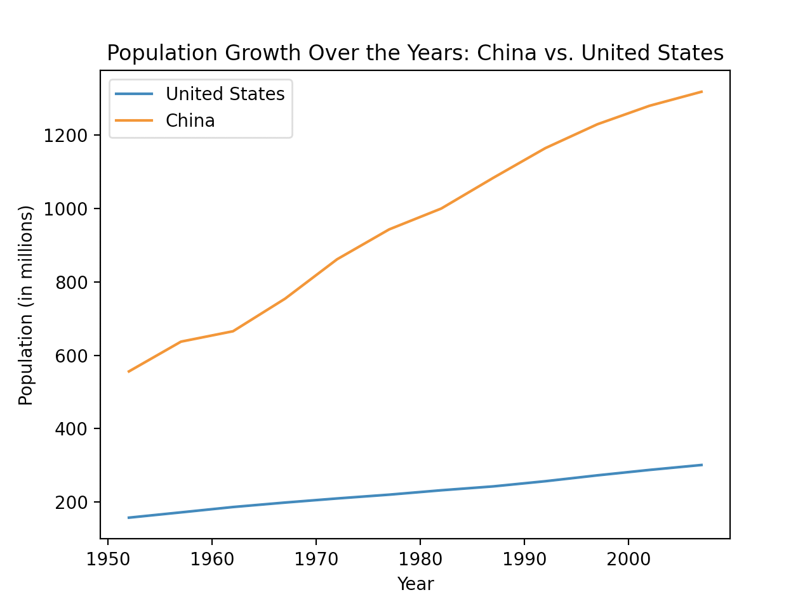
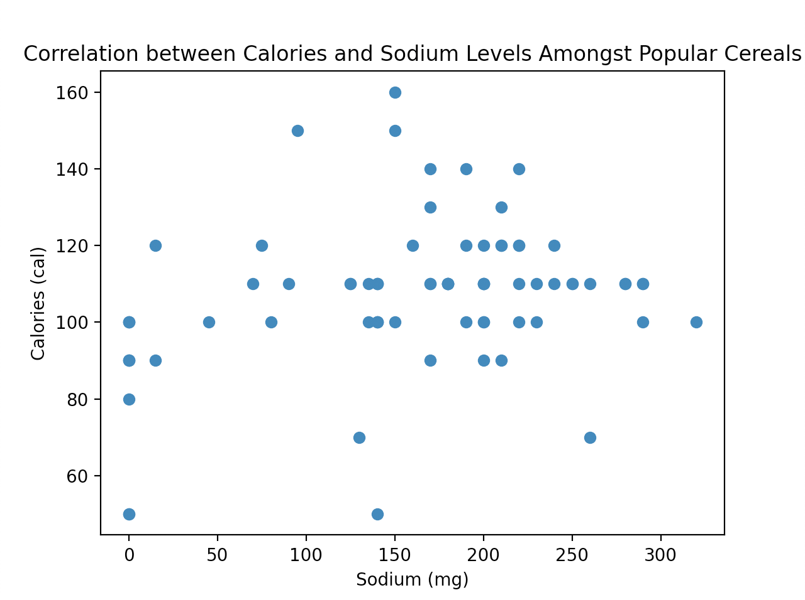

<h1>Homework Project 02</h1>

<h2>Graph 1: Comparing Population Growth</h2>

The data I have plotted here compares population growth in the United States compared to China, from the years 1950 ~ 2000. Here we see a line graph, that contains two elements (orange being China and blue being the US). The x-axis represents Year, and the y-axis represents Population in millions.

I found this data set by scouting the internet. I came across a data visualization website with sample population data [here](https://www.csdojo.io/data). I cross-checked the information shown in the data set, and it seems to be mostly correct. 

<h2>Graph 2: Comparing Sodium and Calories amongst Popular Cereal Brands</h2>

I utlized a scatter plot to compare sodium levels and calories amongst various popular cereals. The point of the graph is to measure some sort of correlation that can be seen. Evidently, there is no strong correlation of any sort between sodium and calorie levels. 

Higher sodium levels don't seem to necessarily indicate higher calories, and lower sodium levels don't seem to indicate that calories will be any lower than usual.

I came across a website with a plethora of sample data sets to view. [Check it out!](https://perso.telecom-paristech.fr/eagan/class/igr204/datasets)

<h3>FYI:
I utlized .csv data sets as they were easy to implement.</h3>

